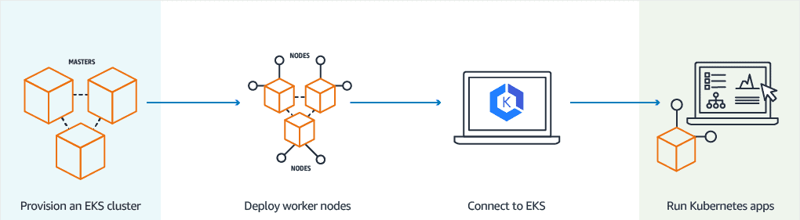
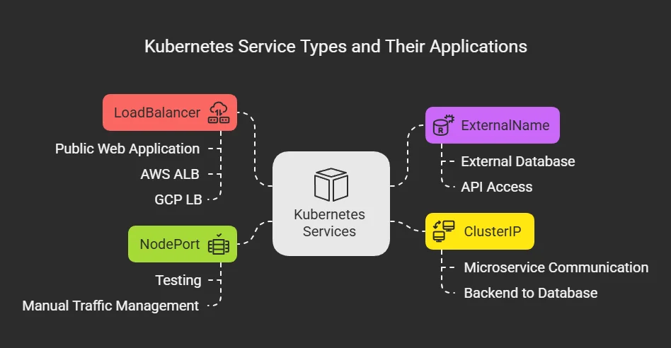

### AWS EKS - Elastic Kubernetes Service (Udemy Course)
#### Installing the 3 clis needed to work with EKS
1. AWS CLI
    - https://docs.aws.amazon.com/cli/latest/userguide/getting-started-install.html
    - To install AWS CLI on Windows using Chocolatey, run the following command in an elevated PowerShell or Command Prompt:
      ```
      choco install awscli
      ```
      - To check if AWS CLI is installed correctly, run:
      ```
      aws --version
      ```
2. kubectl
    - https://kubernetes.io/docs/tasks/tools/install-kubectl/
    - To install kubectl on Windows using Chocolatey, run the following command in an elevated PowerShell or Command Prompt:
      ```
      choco install kubernetes-cli
      ```
      - To check if kubectl is installed correctly, run:
      ```
      kubectl version --client
      ```
3. eksctl
    - https://docs.aws.amazon.com/eks/latest/userguide/eksctl.html  
    - To install eksctl on Windows using Chocolatey, run the following command in an elevated PowerShell or Command Prompt:
      ```
      choco install eksctl
      ```
    - To check if eksctl is installed correctly, run:
      ```
      eksctl version
      ```
#### EKS Cluster Introduction:
- EKS is a managed Kubernetes service provided by AWS that simplifies the process of deploying, managing, and scaling containerized applications using Kubernetes.
- Eks Cluster has 4 main components:
  1. Control Plane
  2. Worker Nodes and node groups
  3. Fargat profiles 
  4. VPC
##### EKS Control Plane:
- The control plane is responsible for managing the Kubernetes cluster and consists of components such as the kube-apiserver, etcd (the cluster's data store), kube-scheduler, and kube-controller-manager.
- It runs a single-tenant control plane for each EKS cluster and is not shared with other AWS accounts or across clusters.
- it consist of atleast 2 api server nodes and 3 etcd nodes that are distributed across 3 Availability Zones (AZs) for high availability.
- EKS automatically detects and replaces unhealthy control plane instances restarting them across the azs within the region as needed. 
- Its a managed service by AWS, meaning AWS takes care of the availability and scalability of the control plane.
- In regular kubernetes setup, you would have to manage the control plane yourself.
##### EKS Worker Nodes and Node Groups:
- Worker nodes are the EC2 instances that run your containerized applications. 
- A node group is one or more worker nodes that share the same configuration, such as instance type, AMI, and scaling policies.
- You can create and manage node groups using eksctl or the AWS Management Console.
- The worker nodes run in our AWS account and connect to our **clusters control plane using the cluster API server endpoint**.
- The ec2 instances are deployed  in a autoscaling group across multiple availability zones for high availability.
##### Fargate Profiles:
- Fargate profiles allow you to run Kubernetes pods on AWS Fargate, which is a serverless compute engine for containers.
- Instead of EC2 instances, we run our application workloads on serverless Fargate profiles.
- Fargate is a technology that provides on-demand, right-sized compute capacity for containers without the need to manage the underlying infrastructure.
- With Fargate we no lo nger have to provision, configure, or scale clusters of virtual machines to run containers.
- Each pod running on fargate has its own isolation boundary and does not share the underlying kernel, CPU resources, memory, or elastic network interface with other pods.
- AWS specifically built fargate controllers that recognize the pods belonging to fargate and schedules them on fargate profiles
- **Fargate profiles only run on private subnets within the VPC.**
##### VPC:
- With AWS VPC we follow secure networking standards which will allow us to run production workloads on EKS.
- EKS uses AWS vpc network policies to restrict traffic between control plane and components within a single cluster
- Control plane components for EKS cluster cannot view view or receive communication from another cluster or other AWS accounts, except as authorized with kubernetes role-based access control (RBAC) and IAM policies.
- This secure and highly available configuration makes EKS reliable anbd recommended for production workloads

### How does EKS work?



#### Create your first EKS Cluster:
- To create an EKS cluster using eksctl, run the following command:
```
  eksctl create cluster --name=eksdemo1 --region=us-east-1 --zones=us-east-1a,us-east-1b --without-nodegroup
```
- This command creates an EKS cluster named "eksdemo1" in the "us-east-1" region, spanning the specified availability zones, without creating a node group.
- To verify that the cluster has been created, run:
```aws eks --region us-east-1 list-clusters```
- This command lists all the EKS clusters in the specified region.
- If you dont specify the region, it will use the default region set in your AWS CLI configuration.
- This takes about 15-20 minutes to create the cluster.
- This command also creates a VPC with public and private subnets, internet gateway, NAT gateway, and route tables.
- Once the cluster is created, eksctl automatically configures your kubectl context to use the new cluster.
- To check the kubectl context, run:
```kubectl config get-contexts```
- This command lists all the kubectl contexts and highlights the current context.
- The kubernetes context contains information about the cluster, user, and namespace.
- To view the details of the current context, run:
```kubectl config view --minify```  
- To view the clusters created in EKS, run:
```eksctl get cluster```
##### Create the IAM OIDC Provider:
- To enable and use AWS roles for kubernetes service accounts on our EKS cluster we must create and associate OIOC provider with our EKS cluster.
- To create an IAM OIDC provider for our EKS cluster, run the following command:
```eksctl utils associate-iam-oidc-provider --region us-east-1 --cluster eksdemo1 --approve```
- This command associates an IAM OIDC provider with the specified EKS cluster in the given region.
- To verify that the OIDC provider has been created, run:
```aws iam list-open-id-connect-providers```
- This command lists all the IAM OIDC providers in your AWS account.
- **This command is now redundant as eksctl automatically creates the OIDC provider when creating the EKS cluster.** 
#### Create EKS Managed Nodes and IAM OIDC Provider:
##### Create EKS Managed Node Group:
- To create an EKS managed node group, run the following command:
```eksctl create nodegroup --cluster=eksdemo1 --region=us-east-1 --name=eksdemo1-ng-public1 --node-type=t3.medium --nodes=2 --nodes-min=2 --nodes-max=4 --node-volume-size=20 --ssh-access --ssh-public-key=shared-key-pair --managed --asg-access --external-dns-access --full-ecr-access --appmesh-access --alb-ingress-access 
```
- This command creates a managed node group named "eksdemo1-ng-public1" in the "eksdemo1" cluster, with t3.medium instance type, 2 initial nodes, minimum 2 nodes, maximum 4 nodes, 20 GB volume size, SSH access using the specified public key, and various IAM permissions for the node group.
      --asg-access                  enable IAM policy for cluster-autoscaler 
      --external-dns-access         enable IAM policy for external-dns
      --full-ecr-access             enable full access to ECR
      --appmesh-access              enable full access to AppMesh
      --appmesh-preview-access      enable full access to AppMesh Preview
      --alb-ingress-access          enable full access for alb-ingress-controller
      --install-neuron-plugin       install Neuron plugin for Inferentia and Trainium nodes (default true)
      --install-nvidia-plugin       install Nvidia plugin for GPU nodes (default true)
      --nodegroup-parallelism int   Number of self-managed or managed nodegroups to create in parallel (default 8)
- All the above permissions can be seen in the IAM role created for the EC2 instances in the node group.
- These permissions allow the worker nodes to interact with other AWS services as needed.
- These can also be added later to the node group IAM role if needed.
- managed node groups are automatically updated and maintained by AWS, making it easier to manage the worker nodes in your EKS cluster.
- The security group created for the node group allows inbound traffic on port 22 (SSH) from anywhere on ipv4 and ipv6. 
- Its called remote access security group.
- To verify that the node group has been created, run:
```eksctl get nodegroup --cluster=eksdemo1 --region=us-east-1```
- This command lists all the node groups in the specified EKS cluster and region.
- On the console you can find the nodegroup under the EKS cluster compute section
- To view the EC2 instances created for the node group, go to the EC2 console and check for instances with the tag "eks:cluster-name" set to "eksdemo1" and "eks:nodegroup-name" set to "eksdemo1-ng-public1".
- To check the kubernetes nodes, run:
```kubectl get nodes```
#### Delete EKS Cluster and Node Group:
- To delete the EKS managed node group, run the following command:
```eksctl delete nodegroup --cluster=eksdemo1 --region=us-east-1 --name=eksdemo1-ng-public1```
- This command deletes the specified node group from the given EKS cluster and region. This should be done before deleting the cluster.
- To delete the EKS cluster, run the following command:
```eksctl delete cluster --name=eksdemo1 --region=us-east-1```
### Docker Fundamentals for EKS:
- Docker is a platform that allows developers to easily create, deploy, and run applications in containers
### Kubernetes Fundamentals: 
- The container runtime is found in both the control plane and worker nodes.
- In eks we have the eks controller manager and fargate controller that manage the worker nodes and fargate profiles respectively.
- The worker nodes still have kubelet, kube-proxy and container runtime installed on them.
- eks lets on focus on deploying and managing applications rather than managing the underlying infrastructure.
#### Imperative vs Declarative:
- Imperative approach involves giving specific commands to achieve a desired state.
- Declarative approach involves defining the desired state of the system and letting the system figure out how to achieve that state.
- Kubernetes uses a declarative approach, where we define the desired state of our applications and the system works to maintain that state.
#### Kubernetes pods: 
- Kubernestes goal is to deploy our applications in the form of containers on worker nodes in a k8s cluster.
- A pod is the smallest deployable unit in kubernetes
- The containers are not deployed directly on the worker nodes, instead they are deployed inside pods.
- A pod can contain one or more containers that share the same network namespace and storage volumes.
- A pod is a single instance of a running process in our cluster.
- Pods are ephemeral, meaning they can be created, destroyed, and recreated as needed.
- Its not good practice to have multiple containers of the same kind in a single pod.
- for instance 2 nginx containers in a single pod is not a good practice.
- Instead create multiple pods with a single nginx container in each pod.
- You can have multiple containers in thesame pod provided they are not of thesame kind and they work together to achieve a common goal.
- For instance helper containers that assist the main container in the pod.
- Helper containers are also known as sidecar containers.
- They are used to pull data required by the main container, perform logging, or handle other auxiliary tasks.
- They also help push data from the main container to external systems.
- They can also server as proxies for the main container.
- when app is growing scale the number of pods rather than increasing the number of containers in a pod.
##### K8s pods demo:
###### Kubeconfig file:
The kubeconfig file is used to configure access to Kubernetes clusters. It contains:
Authentication & Authorization:
Cluster API server endpoints (URLs)
Certificate authority data for secure connections
User credentials (certificates, tokens, or authentication provider configs)
Configuration Details:
Clusters: List of Kubernetes clusters you can connect to (name, server URL, CA cert)
Users: Authentication credentials for different users/service accounts
Contexts: Combinations of cluster + user + namespace that define "where" and "as whom" you're working
Current-context: Which context is active (which cluster you're currently talking to)
What it enables:
Switch between multiple Kubernetes clusters (dev, staging, prod)
Use different credentials for different clusters
Set default namespaces per context
Allow kubectl to know which cluster to send commands to
- Each team member can have their own kubeconfig file with access to specific clusters.
- The kubeconfig file is typically located at ~/.kube/config on Linux and macOS,
- to generate the kubeconfig file for an EKS cluster, you can use the AWS CLI command:
```bash
aws eks update-kubeconfig --region region-code --name cluster-name
```

- Make sure that your kubeconfig file located at `C:\Users\your-username\.kube\config` is configured to use the correct EKS cluster context.
- If not run this command to update it:

```bash
aws eks update-kubeconfig --region us-east-1 --name "eks cluster name"
# Example:
aws eks update-kubeconfig --region us-east-1 --name int-preproduction-use1-shared-eks-cluster-eks-cluster
```

###### Creating a namespace using kubectl:
- Run this command to create a new namespace
```kubectl create namespace hway```
- To verify the namespace has been created, run:
```kubectl get namespaces```

###### Creating a pod using kubectl:

- Run this command to check the nodes
```kubectl get nodes```
- Run this command to create a new pod
```
kubectl run my-first-pod --image njibrigthain100/brigthain:cognilife 
```
- You can use the describe pod command to get detailed information about the pod
```kubectl describe pod my-first-pod```
- This information can be found on the console under the pods section of the EKS cluster. 
- Go to the eks cluster and under resource select  pods and select the namespace in which the pod is created, by default its created in the default namespace.
- To check the logs of the pod, run:
```kubectl logs my-first-pod```
- To delete the pod, run:
```kubectl delete pod my-first-pod```

##### K8s service demo:
- A kubernetes service is an abstraction that defines a logical set of pods and a policy by which to access them.
- We can expose an application running on a set of pods using different types of services.
- The most common types of services are:
  1. ClusterIP: Exposes the service on a cluster-internal IP. This type makes the service only reachable from within the cluster.
  2. NodePort: Exposes the service on each Node's IP at a static port (the NodePort). This type makes the service accessible from outside the cluster using <NodeIP>:<NodePort>. You cannot specify the nodeport when creating the service in an imperative way using kubectl. It will be automatically assigned from a range of ports (default: 30000-32767).
  3. LoadBalancer: Exposes the service externally using a cloud provider's load balancer. This type creates an external load balancer that routes traffic to the service.

###### NodePort Service Demo:
- what are the different ports in kubernetes service?
  1. Target Port: The port on which the application is running inside the pod.
  2. Port: The port on which the service is exposed inside the cluster. The service listens on this port and forwards traffic to the target port of the pods.
  3. NodePort: The port on which the service is exposed on each node in the cluster. Worker nodes listen on this port and forward traffic to the service.
- After creating the pod, run this command to create a NodePort service:
```kubectl expose pod my-first-pod --type=NodePort --name=my-first-service --port=80 --target-port=80
```
- This command creates a NodePort service named "my-first-service" that exposes port 80 and forwards traffic to port 80 of the "my-first-pod" pod.
- To get the details of the service, run:
```kubectl get service my-first-service```
- This command displays the details of the service, including the NodePort assigned to it.
- To access the service from outside the cluster, use the public IP address of any worker node and the NodePort assigned to the service.
- You can find the public IP addresses of the worker nodes in the EC2 console.
- To find out what node the pod is running on, run:
```kubectl get pod my-first-pod -o wide```
- To access the application on a browser get the public ip of the node and the nodeport assigned to the service.
- For example, if the public IP of the node is 54.210.123.45 and the NodePort assigned to the service is 30080, you can access the application using the URL:
```http://54.210.123.45:30080```
- To get the nodeport of the service, run:
```kubectl get service my-first-service -o jsonpath='{.spec.ports[0].nodePort}'```
- Make sure that the node security group allows inbound traffic on the nodeport from your IP address.
- The above information can also be found on the console under the services section of the EKS cluster.
- You are able to access the application on the other node as well since the service is exposed on all nodes in the cluster.
- To view the pod logs , run:
```kubectl logs my-first-pod```
- To view the logs in real-time, run:
```kubectl logs my-first-pod -f```
- To get the yaml configuration of the pod, run:
```kubectl get pod my-first-pod -o yaml```
- This provides the complete configuration of the pod in yaml format.

#### ReplicaSets:
- A ReplicaSet is a Kubernetes resource that ensures a specified number of pod replicas are running at any given time.
- It monitors the pods and automatically creates or deletes pods to maintain the desired number of replicas.
- ReplicaSets are typically used to ensure high availability and scalability of applications running in a Kubernetes cluster.
- ReplicaSets are usually created and managed by Deployments, which provide additional features such as rolling updates and rollbacks.
- **Labels and selectors** are used to identify and manage the pods that belong to a ReplicaSet.
- So a combination of replicasets and services help in load balancing and high availability of applications in a kubernetes cluster.
- The service distributes traffic across the multiple pod replicas managed by the ReplicaSet.
##### ReplicaSet Demo:
- To create a ReplicaSet, we first need to create a yaml file that defines the Replica
- Set configuration. Here is an example of a ReplicaSet yaml file named `my-replicaset.yaml`:
```apiVersion: apps/v1
kind: ReplicaSet
metadata:
  name: my-replicaset
spec:
  replicas: 3
  selector:
    matchLabels:
      app: my-app
  template:
    metadata:
      labels:
        app: my-app
    spec:
      containers:
      - name: my-app
        image: my-app-image
        ports:
        - containerPort: 80
````
- To expose the replicaset as a service we can either run the cli command shown below or create a service yaml file.
```kubectl expose rs my-replicaset --type=NodePort --name=my-replicaset-service --port=80 --target-port=80```
- To expose it using the yaml file create a file named `my-replicaset-service.yaml` with the following content:
```apiVersion: v1
kind: Service
metadata:
  name: my-replicaset-service
spec:
  type: NodePort
  selector:
    app: my-app
  ports:
  - protocol: TCP
    port: 80
    targetPort: 80
```
- This exposes the ReplicaSet as a NodePort service named "my-replicaset-service" that listens on port 80 and forwards traffic to port 80 of the pods managed by the ReplicaSet.
- In this case the request gets distributed across the 3 pod replicas created by the ReplicaSet.
- To verify if the replicaset maintains the pods as expected, we can delete one of the pods and check if the replicaset creates a new pod to maintain the desired number of replicas.
- First get the list of pods created by the replicaset using the command:
```kubectl get pods -o wide```
- This command lists all the pods 
- To delete one of the pods, run:
```kubectl delete pod <pod-name>```
- Replace `<pod-name>` with the name of the pod you want to delete.
- After deleting the pod, run the command again to get the list of pods:
```kubectl get pods -o wide```
- You should see that a new pod has been created by the ReplicaSet to maintain the desired number of replicas.
- We can scale our replica set by changing the replicas count in the yaml file and applying the changes using the command:
```kubectl apply -f my-replicaset.yaml```
- **Important concept**: services dont target replicasets by names but rather pods by using labels and selectors.

#### Deployments:
- A Deployment is a higher-level Kubernetes resource that manages ReplicaSets and provides declarative updates to applications.
- Deployments allow you to define the desired state of your application, including the number of replicas, the container image to use, and other configuration details.
- When you create a Deployment, Kubernetes automatically creates a ReplicaSet to manage the pods for that Deployment.
- Deployments provide features such as rolling updates, rollbacks, and scaling, making it easier to manage applications in a Kubernetes cluster.
- You can also pause and resume deployments, allowing you to control the rollout of updates to your application.
- **Clean up policy** is another important feature of deployments that helps manage the lifecycle of ReplicaSets and pods. This policy determines how many old ReplicaSets and pods are retained when a new deployment is made.
- By default, Kubernetes retains all old ReplicaSets and pods, which can lead to resource consumption and clutter in the cluster.
- However, you can configure the clean up policy to limit the number of old ReplicaSets and pods that are retained.
- This helps free up resources and keeps the cluster clean and organized.
- **Canary deployments** are a deployment strategy that allows you to release new versions of your application to a small subset of users before rolling it out to the entire user base.
- This approach helps minimize the impact of potential issues with the new version by limiting exposure.
- In Kubernetes, canary deployments can be implemented using Deployments and Services.
##### Deployment Demo:
- To create a deployment via the cli you can run the command:
```kubectl create deployment my-deployment --image=njibrigthain100/brigthain:hwv1```
- This command creates a deployment named "my-deployment" using the specified container image.
- To expose the deployment as a service, run:
```kubectl expose deployment my-deployment --type=NodePort --name=my-deployment-service --port=80 --target-port=80```
- This command creates a NodePort service named "my-deployment-service" that exposes port 80 and forwards traffic to port 80 of the pods managed by the deployment.
- To verify the deployment and service, run:
```kubectl get deployments```
```kubectl get services```
- To scale the deployment, run:
```kubectl scale deployment my-deployment --replicas=4```
- This command scales the deployment to 4 replicas.
- To update the deployment with a new container image, first find the container name:
```kubectl get deployment dashboard -o jsonpath='{.spec.template.spec.containers[*].name}'```
- Then update the image using the correct container name:
```kubectl set image deployment/my-deployment brigthain=njibrigthain100/brigthain:hwv2 --record=true```
- This command updates the container image of the deployment to the specified new image.
- Kubernetes will automatically create a new ReplicaSet with the updated image and gradually replace the old pods
- To roll back the deployment to the previous version, run:
```kubectl rollout undo deployment/my-deployment```
- This command rolls back the deployment to the previous version.
- To check the rollout status of the deployment, run:
- ```kubectl rollout status deployment/my-deployment```
- To roll back to the second last version, run:
```kubectl rollout undo deployment/my-deployment --to-revision=2```
- To view the revision history of the deployment, run:
```kubectl rollout history deployment/my-deployment```
- This command displays the revision history of the deployment, including the revision numbers and the corresponding container images.
- To create the deployment with a yaml file create a file named `my-deployment.yaml` with the following content:
```apiVersion: apps/v1
kind: Deployment
metadata:
  name: my-deployment
spec:
  replicas: 3
  selector:
    matchLabels:
      app: my-app
  template:
    metadata:
      labels:
        app: my-app
    spec:
      containers:
      - name: my-app
        image: my-app-image
        ports:
        - containerPort: 80
```
- To create the deployment using the yaml file, run:
```kubectl apply -f my-deployment.yaml```
- Kubernetetes deployment typically use rolling update strategy by default to update the application with zero downtime.
- In a rolling update, the deployment gradually replaces old pods with new pods, ensuring that at least a minimum number of pods are always available to serve traffic.
- This approach allows for a smooth transition between application versions without disrupting service availability.- You can customize the rolling update strategy by specifying parameters such as `maxUnavailable` and `maxSurge` in the deployment yaml file.
- `maxUnavailable` specifies the maximum number of pods that can be unavailable during the update process, while `maxSurge` specifies the maximum number of additional pods that can be created during the update process.
- By adjusting these parameters, you can control the speed and impact of the rolling update on your application.
- During an update a new replicaset is created with the new pod template and the old replicaset is scaled down gradually until all the pods are replaced with the new ones.

##### Deployment Edit using kubectl:
- This is the method mostly used to update our applications in kubernetes. 
- To edit your deployment run the command:
```kubectl edit deployment my-deployment --record=true```
- This opens the deployment configuration in the default text editor.
- Make the necessary changes to the deployment configuration, such as updating the container image or changing the number of replicas.
- Save and close the editor to apply the changes.

##### Deployment Rollback application to a previous version:
- To roll back the deployment to the previous version, run:
```kubectl rollout undo deployment/my-deployment```
- This command rolls back the deployment to the previous version.
- To check the rollout status of the deployment, run:
- ```kubectl rollout status deployment/my-deployment```
- To roll back to the second last version, run:
```kubectl rollout undo deployment/my-deployment --to-revision=2```
- To rollback to a specific revision, run:
```kubectl rollout undo deployment/my-deployment --to-revision=<revision-number>```
- To view the revision history of the deployment, run:
```kubectl rollout history deployment/my-deployment```
- To view exaclty what changed in a specific revision, run:
```kubectl rollout history deployment/my-deployment --revision=<revision-number>```
- Now to rollback to previous version you can simp-ly run the undo command without specifying the revision number.
- Everytime you make a change to the deployment using the edit command a new revision is created.
- The revision number is incremented automatically by kubernetes.
- You can also restart the deployment to recreate all the pods without changing the deployment configuration by running:
```kubectl rollout restart deployment/my-deployment```

##### Deployment pausing and resuming deployments:
- To pause a deployment, run:
```kubectl rollout pause deployment/my-deployment```
- To resume a paused deployment, run:
```kubectl rollout resume deployment/my-deployment```
- This is needed when you want to make **multiple changes** to the deployment configuration without triggering a rollout for each change.
- You can pause the deployment, make all the necessary changes, and then resume the deployment to apply all the changes at once.
- Everyytime you create a new deployment a new replicaset is created to manage the pods for that deployment.
- The old replicaset is retained by default unless you specify a clean up policy to limit the number of old replicasets to retain.

#### Services:
- A Kubernetes Service is an abstraction that defines a logical set of pods and a policy by which to access them.
- Services enable communication between different components of an application running in a Kubernetes cluster.
- Services provide a stable IP address and DNS name for a set of pods, allowing other components to access them without needing to know the specific pod IP addresses.
- Services can be exposed in different ways, such as ClusterIP, NodePort, LoadBalancer, and ExternalName, depending on the use case and requirements.
**ClusterIP**: The default type of service that exposes the service on a cluster-internal IP. This type makes the service only reachable from within the cluster. This can be used for internal communication between different components of an application. Or for communication between frontend and backend services within the cluster.
**NodePort**: Exposes the service on each Node's IP at a static port (the NodePort). This type makes the service accessible from outside the cluster using <NodeIP>:<NodePort>. This can be used for development and testing purposes, where you want to access the service from outside the cluster without setting up a load balancer.
**LoadBalancer**: Exposes the service externally using a cloud provider's load balancer. This type creates an external load balancer that routes traffic to the service. This can be used for production workloads where you want to expose the service to the internet and distribute traffic across multiple pods for high availability and scalability.
**ingress**: Ingress is not a type of service but rather a separate Kubernetes resource that manages external access to services in a cluster, typically HTTP/HTTPS traffic. Ingress can provide load balancing, SSL termination, and name-based virtual hosting. Ingress controllers are used to implement the ingress resource and route traffic to the appropriate services based on defined rules. Its advanced load balancing which provides context path based routing, SSL, SSL redirects and many more features.
**ExternalName**: Maps a service to a DNS name outside the cluster. This type can be used to access external services from within the cluster using a consistent DNS name. These are used to access externally hosted apps in kubernetes cluster. For instance AWS RDS database endpoint is to be accessed by an application running in the kubernetes cluster. We can create an externalname service that maps to the RDS endpoint and the application can use the service name to access the database.


##### Services demo:
- Go to the github reo and proceed to 05- Services with kubectl 
## Step-01: Introduction to Services
- **Service Types**
  1. ClusterIp
  2. NodePort
  3. LoadBalancer
  4. ExternalName
- We are going to look in to ClusterIP and NodePort in this section with a detailed example. 
- LoadBalancer Type is primarily for cloud providers and it will differ cloud to cloud, so we will do it accordingly (per cloud basis)
- ExternalName doesn't have Imperative commands and we need to write YAML definition for the same, so we will look in to it as and when it is required in our course. 

## Step-02: ClusterIP Service - Backend Application Setup
- Create a deployment for Backend Application (Spring Boot REST Application)
- Create a ClusterIP service for load balancing backend application. 
```
# Create Deployment for Backend Rest App
kubectl create deployment my-backend-rest-app --image=stacksimplify/kube-helloworld:1.0.0 
kubectl get deploy

# Create ClusterIp Service for Backend Rest App
kubectl expose deployment my-backend-rest-app --port=8080 --target-port=8080 --name=my-backend-service
kubectl get svc
Observation: We don't need to specify "--type=ClusterIp" because default setting is to create ClusterIp Service. 
```
- **Important Note:** If backend application port (Container Port: 8080) and Service Port (8080) are same we don't need to use **--target-port=8080** but for avoiding the confusion i have added it. Same case applies to frontend application and service. 

- **Backend HelloWorld Application Source** [kube-helloworld](../00-Docker-Images/02-kube-backend-helloworld-springboot/kube-helloworld)

## Step-03: NodePort Service - Frontend Application Setup
- We have implemented **NodePort Service** multiple times so far (in pods, replicasets and deployments), even then we are going to implement one more time to get a full architectural view in relation with ClusterIp service. 
- Create a deployment for Frontend Application (Nginx acting as Reverse Proxy)
- Create a NodePort service for load balancing frontend application. 
- **Important Note:** In Nginx reverse proxy, ensure backend service name `my-backend-service` is updated when you are building the frontend container. We already built it and put ready for this demo (stacksimplify/kube-frontend-nginx:1.0.0)
- **Nginx Conf File**
```conf
server {
    listen       80;
    server_name  localhost;
    location / {
    # Update your backend application Kubernetes Cluster-IP Service name  and port below      
    # proxy_pass http://<Backend-ClusterIp-Service-Name>:<Port>;      
    proxy_pass http://my-backend-service:8080;
    }
    error_page   500 502 503 504  /50x.html;
    location = /50x.html {
        root   /usr/share/nginx/html;
    }
}
```
- **Docker Image Location:** https://hub.docker.com/repository/docker/stacksimplify/kube-frontend-nginx
- **Frontend Nginx Reverse Proxy Application Source** [kube-frontend-nginx](../00-Docker-Images/03-kube-frontend-nginx)
```
# Create Deployment for Frontend Nginx Proxy
kubectl create deployment my-frontend-nginx-app --image=stacksimplify/kube-frontend-nginx:1.0.0 
kubectl get deploy

# Create ClusterIp Service for Frontend Nginx Proxy
kubectl expose deployment my-frontend-nginx-app  --type=NodePort --port=80 --target-port=80 --name=my-frontend-service
kubectl get svc

# Capture IP and Port to Access Application
kubectl get svc
kubectl get nodes -o wide
http://<node1-public-ip>:<Node-Port>/hello

# Scale backend with 10 replicas
kubectl scale --replicas=10 deployment/my-backend-rest-app

# Test again to view the backend service Load Balancing
http://<node1-public-ip>:<Node-Port>/hello
```rld Application Source** [kube-helloworld](../00-Docker-Images/02-kube-backend-helloworld-springboot/kube-helloworld)

#### Kubernetes declarative approach using YAML files:
- Instead of using the imperative commands to create kubernetes resources we can also use the declarative approach using yaml files.
- The yaml files can be created manually or generated using the kubectl command.
- To generate the yaml file for a deployment, run:
```kubectl get deployment my-deployment -o yaml > my-deployment.yaml```
- This command retrieves the configuration of the specified deployment and saves it to a yaml file named `my-deployment.yaml`.
- You can then edit the yaml file to make any necessary changes to the deployment configuration.
- To apply the changes and create or update the deployment, run:
```kubectl apply -f my-deployment.yaml```
- This command creates or updates the deployment based on the configuration defined in the yaml file.
- This documentation explains how to create a simple pod using a yaml file.
- https://kubernetes.io/docs/concepts/workloads/pods/
- The top level objects in kubernetes are apiversion, kind, metadata and spec.
- apiversion: specifies the version of the kubernetes api being used to create the object.
- kind: specifies the type of object being created (pod, deployment, service, etc). 
- metadata: contains information about the object such as name, namespace, labels, and annotations.
- spec: defines the desired state of the object, including configuration details such as container images, ports, volumes, and resource requirements.
- In the metadata section the name and the labels are the most important fields.
- The name is used to uniquely identify the object within the namespace.
- Labels are key-value pairs that are used to organize and select objects in kubernetes.
- The namespace is used to group related objects together and provide a scope for names. This is also set in the metadata section.
- The spec section contains the configuration details of the object.
- After writing the yaml file we can create the object using the command:
```kubectl apply -f pod.yaml```


