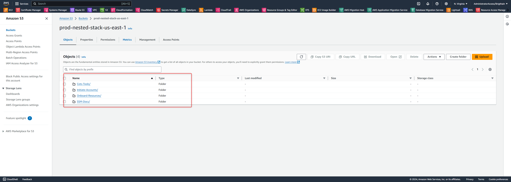
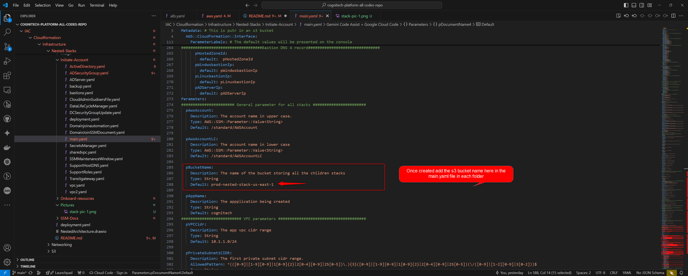
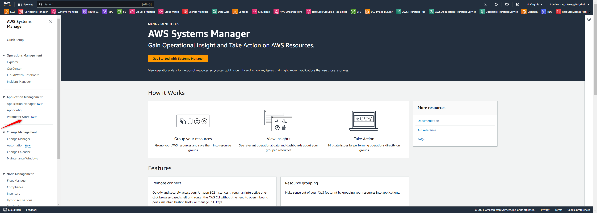
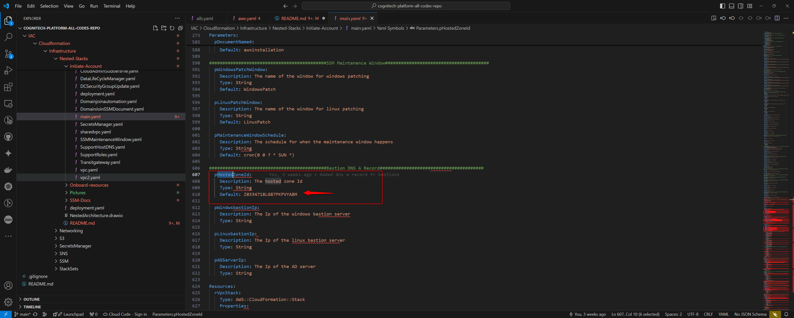
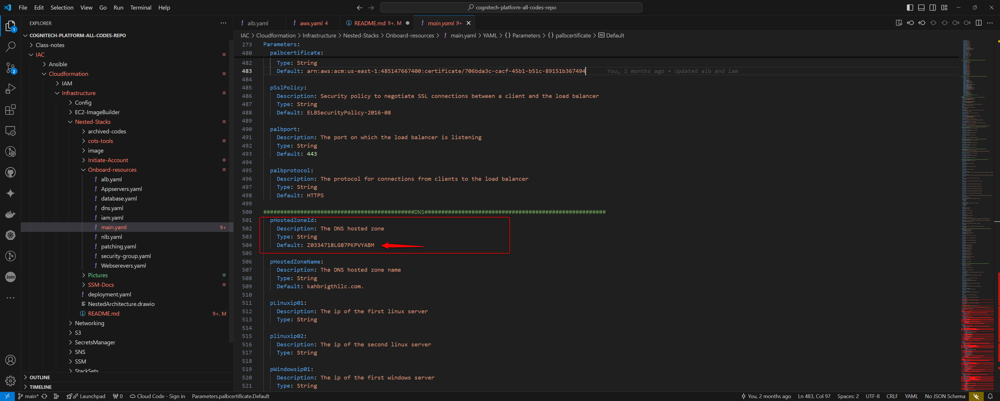

### ***DEPLOYING A 3 TIER ARCHITECTURE AND SUPPORTING SERVICES USING CLOUDFORMATION NESTED STACKS***

### SYNOPSIS:

    This project will allow you to deploy a 3 tier architecture (app, web and database server) with supporting resources for infrastructure maintenance. This project assumes that youae familar with basic aws services, linux and github.

### **RESOURCES TO BE CREATED UPON COMPLETION OF THE PROJECT:**

##### *Networking:*

* 2 vpcs ( sharewd services and app vpc)
* 2 private and 2 public subnets per vpc
* 2 nat gateways in each public subnet per vpc
* 2 elastic Ips associated to the nat gateway per vpc
* 1 transit gateway for connection between app and shared services vpc

##### *Compute:*

* 1 windows active directory server
* 1 ssh bastion security group
* 1 rdp bastion security group
* 1 active directory security group
* 1 alb security group
* 1 nlb security group
* 1 windows app security group
* 1 linux app security group
* 1 windows we security group
* 1 linux web security group
* 1 elastic file share (efs) security group
* 1 windows file share (fsx) security group
* IAM roles for bastion, active directory server, app, web and database servers
* Application load balancer
* 1 window and 1 linux app server
* 2 windows and 2 linux web servers
* 1 windows database server
* Network load balancer
* 1 fsx share
* 1 fsx share
* instance scheduler

##### *Support:*

* AWS Mnaged Microsoft directory service
* 3 system manager documents
* Data lifecycle Manager
* 3 system manager association for automation
* System manager maintenance window
* secrets manager secret for linux domain join
* DNS A records for bastion and active directory server
* AWS Backup

### TASK SUMMARY:

- The following preconditions will have to be met for succesfull completion of the project:
  - Clone this repo. The repo can be found [here](https://github.com/njibrigthain100/cognitech-platform-all-codes-repo) and contains all the stacks needed for the project (Please check [here](https://education.github.com/git-cheat-sheet-education.pdf) for frequently used github commands)
  - Create an s3 bucket for storage of all the yaml files needed for stack creation (The bucket can be created via any means i.e IAC or manual)
    - create parameter with the following names in the parameter store (This will be explained below)
      - /standard/AWSAccount
      - /standard/AWSAccountLC
      - /standard/SharedServicesVpc
    - Create 3 system manager  documents with the following names (This will be explained below)
      - LinuxCloudAdmins
      - Linuxpackageinstall
      - awxinstallation
    - Create a domain with AWS route 53
    - Create a hosted zone in the above domain

### HOW TO DEPLOY THE INFRASTRUCTURE:

* The resources on this project are deployed in 3 steps. There are 3 folders containing the yaml files for deployment of all the resources for each step. They are:
  * Initiate Account folder:
    * This folder contains the yaml files for creation of the foundation resources such as vpc, subnet, internet gateway, nat gateway etc. Most resources to be created will have a depenedency on these so ensure that there are no errors during this process
    * Onboard-resources folder:
      * This folder contains the yaml files for creation for the compute resources such as the app, web and database servers and much more
    * Cots-tools folder:
      * This folder contains the yaml files for the creation of support resources such as windows file share (fsx), linux file share (efs), instance scheduler and more
    * SSM-Docs folder:
      * This folder contains all the system manager document needed for the project

### WARNING:

* This project contains resources that may accrue charges if left on. Proceed with caution.

### TASK DETAIL:

###### *Repository Clonning:*

* Once the repository has been succesfully cloned download all the files and folders in the IAC\Cloudformation\Infrastructure\Nested-Stacks folder.

###### *Bucket Creation and file upload:*

* ./PicturesAll resources for stack creation are going to be stored in an s3 bucket. Please see [here](https://docs.aws.amazon.com/AmazonS3/latest/userguide/GetStartedWithS3.html) on how to create an s3 bucket.
* Create multiple folders as shown below in the bucket. These folders will be used to store the yaml files for resource creation
  
* The above folders have to be named exactly as shown as these are refernced in the cloudformation templates.
* For each of the above folders upload all the files in the corresponfing folders from the github repository that was downloaded in the first step. For instance all files in Initiate account from the github repository should be uploaded to the Initiate-Account in the s3 bucket folder
* now add the name of the s3 bucket to the main.yaml file in each of the folders as shown below:
  

###### *SSM Parameter creation:*

* Some parameters will be commonly used across most templates so to avoid having to reference them all the time we will be creating them in the parameter store.  The parameters are:

- /standard/AWSAccount
- /standard/AWSAccountLC
- /standard/SharedServicesVpc
- Please see below on how to create a parameter in AWS system manager parameter store and how to add them to your cloudformation template:

  

###### *SSM Document creation:*

* The system manager document are used for a variety of reasons ranging from domain joining of the newly created instances, to adding the newly created linux servers to the sudoers. These documents are created via cli commands as shown below.
* All ssm documents are located in the SSM-Doc folder.
* Once all files and folders have been downloaded to your local computer navigate to the SSM-Docs directory and run the following commands to create the documents.

  * LinuxCloudAdmins:
    * aws ssm create-document --content [file://CloudAdminSudoersFile.yaml](file://CloudAdminSudoersFile.yaml) --name "LinuxCloudAdmins" --document-type "Command" --document-format YAML
  * Linuxpackageinstall:
    * aws ssm create-document --content [file://Linuxpackageinstall.yaml](file://Linuxpackageinstall.yaml) --name "Linuxpackageinstall" --document-type "Command" --document-format YAML
  * AWXInstallation:
    * aws ssm create-document --content [file://awx.yaml](file://awx.yaml) --name "awxinstallation" --document-type "Command" --document-format YAML
* FYI: The documents have to be named exactly as shown above as they are all referenced in the cloudforation template as seen below:

  

###### *Create a route 53 domain:*

* A domain is needed to house all the dns records that will be created during the project. PLease see [Register a new domain](https://docs.aws.amazon.com/Route53/latest/DeveloperGuide/domain-register.html) on how to create a new domain in aws route 53
* Once the domain has been created and verifed create a public hosted zone. Please see [Creating a public hosted zone](https://docs.aws.amazon.com/Route53/latest/DeveloperGuide/CreatingHostedZone.html) on how to create a public hosted zone.
* Once done add the hosted zone Id to the main.yaml file in the Initiate-Account and Onboard-resources as shown below

  

