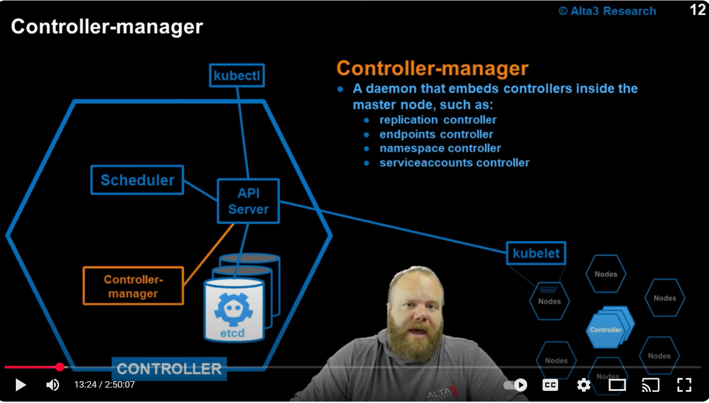
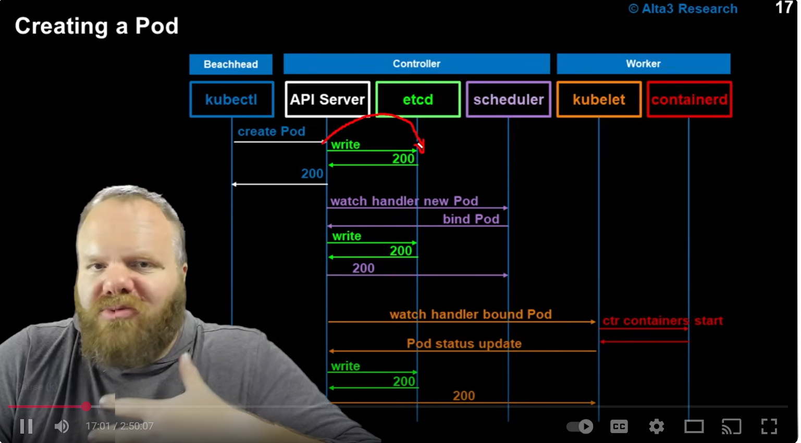

What is Kubernetes?
Kubernetes is an open-source container orchestration platform designed to automate the deployment, scaling, and management of containerized applications. It provides a framework for running distributed systems resiliently, allowing developers to manage microservices architectures with ease. Kubernetes abstracts away the underlying infrastructure, enabling developers to focus on building applications without worrying about the complexities of the environment in which they run.
Containers are:
    1. Easy to create multiple containers
    2. Lightweight and portable
    3. Provide process isolation
    4. Can be easily scaled
    5. Easy to tear down and rebuild
    6. works thesame way no matter where they are deployed
Problems with running containers as we are: 
    1. Host machine runs out of resources
    2. containers die and get ignored 
    3. host machine goes down taking everything with it  
Kubernetes solves these problems by:
    1. Kubernetes containers are placed in kubernetes objects called pods which are wrappers placed around the container. kubernetes manages pods not containers so by putting them together in one unit makes it easy to control
    2. Kubernetes containers need to draw their resources in a virtual machine which are called nodes. you can add multiple nodes to thesame environment. When you do that you end up exponentially increasing the available resources for your containers.
    3. When you combine all nodes together you get a kubernetes cluster. A kubernetes cluster is a collection of nodes that work together to provide resources for your containers. If one node goes down the other nodes in the cluster can take over and keep your containers running.
    4. There are 2 flavors of nodes. One is called the master node (controller node) and the other is called the worker node. The master node is responsible for managing the cluster and the worker nodes are responsible for running the containers. The master node runs a component called the kube-apiserver which is the main entry point for all kubernetes commands. The kube-apiserver communicates with the other components of the master node to manage the cluster. The worker nodes run a component called the kubelet which is responsible for communicating with the master node and managing the pods on the worker node. Each worker node can run one or multiple pods.
    5. The master node also runs a component called the etcd which is a distributed key-value store that stores all the configuration data for the cluster. The etcd is responsible for maintaining the state of the cluster and ensuring that all the nodes are in sync.

What is happening under the hood in kubernetes: 
    1. kubectl is the cli tool that will be installed on your local machine to interact with the kubernetes cluster. When you run a kubectl command it communicates with the kube-apiserver on the master node to perform the requested action.
    2. The kube-apiserver then communicates with the other components of the master node
    3. A kube config file is a document that contains the information needed to connect to a kubernetes cluster. It typically includes the cluster's API server endpoint, authentication information, and other settings. an example is 
    apiVersion: v1
    clusters:
      - cluster:
          server: https://<API_SERVER_ENDPOINT>
          certificate-authority: <PATH_TO_CA_CERTIFICATE>
        name: <CLUSTER_NAME>
    4. The api server is what will be returning the information to kubectl when you run a command. The api server is the main entry point for all kubernetes commands and it communicates with the other components of the master node to manage the cluster.
    5. It also reaches out to the other nodes that are part of our cluster to get information about the pods that are running on those nodes. 
    6. It also talks to etcd to store and retrieve configuration data for the cluster. The etcd is a distributed key-value store that stores all the configuration data for the cluster. The etcd is responsible for maintaining the state of the cluster and ensuring that all the nodes are in sync. etcd is third party tool that kubernetes uses to store its data. Be very respectful of etcd as it is the brain of the cluster. If etcd goes down the entire cluster goes down.
    7. The scheduler is responsible for scheduling pods on the worker nodes. The scheduler looks at the available resources on each node and decides which node is best suited to run the pod. The scheduler also takes into account any constraints that are specified in the pod's configuration, such as node affinity or taints and tolerations.
    8. The controller manager is responsible for managing the various controllers that are running in the cluster. Controllers are responsible for ensuring that the desired state of the cluster is maintained. For example, if a pod is deleted, the replication controller will create a new pod to replace it. The controller manager also manages other controllers such as the node controller, which is responsible for monitoring the status of the nodes in the cluster, and the endpoint controller, which is responsible for managing the endpoints for services.
    
    9. Kubelet: This is present on every single node in the cluster. The kubelet is responsible for communicating with the master node and managing the pods on the worker node. The kubelet ensures that the containers in the pod are running and healthy. If a container dies, the kubelet will restart it. The kubelet also reports the status of the pods to the master node. This is the eyes and the ears of the nodes. All instructions coming from the controller node go through the kubelet. The kubelet is responsible for ensuring that the desired state of the pod is maintained. If a pod is deleted, the kubelet will ensure that a new pod is created to replace it. 
    10. Containers runtime: This is the software that is responsible for running the containers. Kubernetes supports several different container runtimes, including Docker, containerd, and CRI-O. The container runtime is responsible for pulling the container image from a registry, creating the container, and starting the container. The container runtime also monitors the health of the container and reports the status to the kubelet.
     
    11. There are many types of apis in kubernetes. The most common are:
        a. Core API: This is the main api that is used to manage the core resources in kubernetes, such as pods, services, and deployments. The core api is versioned and the current version is v1.
        b. Apps API: This api is used to manage applications in kubernetes, such as deployments, statefulsets, and daemonsets. The apps api is versioned and the current version is v1.
        c. Batch API: This api is used to manage batch jobs in kubernetes, such as cronjobs and jobs. The batch api is versioned and the current version is v1.
        d. Networking API: This api is used to manage networking resources in kubernetes, such as ingress and network policies. The networking api is versioned and the current version is v1.
        e. Custom Resource Definitions (CRDs): This api allows users to define their own custom resources in kubernetes. CRDs are not part of the core kubernetes api and are not versioned.
    12. Restarts on a pod can be caused by several factors, including:
        a. Application crashes: If the application running inside the container crashes or exits unexpectedly, the pod will be restarted by the kubelet.
        b. Resource constraints: If the pod exceeds its resource limits (CPU, memory, etc.), the kubelet may terminate the pod and restart it to free up resources.
        c. Node failures: If the node hosting the pod fails or becomes unreachable, the pod will be rescheduled to another node and restarted.
        d. Liveness and readiness probes: If a liveness probe fails, indicating that the application is not healthy, the kubelet will restart the pod. Similarly, if a readiness probe fails, the pod may be restarted to ensure it becomes ready to serve traffic.
        e. Manual intervention: An administrator may manually delete or restart a pod for maintenance or troubleshooting purposes.
        f. Configuration changes: Changes to the pod's configuration (e.g., updating environment variables or volume mounts) may trigger a restart of the pod to apply the new settings.
Kubernetes cli commands:
    1. Kubectl get: This command is used to retrieve information about the resources in the cluster. The syntax for this command is kubectl get <resource_type> <resource_name>. For example, to get a list of all pods in the cluster, you would run kubectl get pods.
    2. kubectl apply: This command is used to create or update resources in the cluster. The syntax for this command is kubectl apply -f <file_name>. For example, to create a new deployment from a yaml file, you would run kubectl apply -f deployment.yaml.
    3. kubectl describe: This command is used to get detailed information about a specific resource in the cluster. The syntax for this command is kubectl describe <resource_type> <resource_name>. For example, to get detailed information about a specific pod, you would run kubectl describe pod <pod_name>. To describe a namespace you would run kubectl describe namespace <namespace_name>.
    4. kubectl delete: This command is used to delete resources from the cluster. The syntax for this command is kubectl delete <resource_type> <resource_name>. For example, to delete a specific pod, you would run kubectl delete pod <pod_name>. you can also delete the mainfest file by running kubectl delete -f <file_name>.
    5. kubectl logs: This command is used to retrieve the logs from a specific pod. The syntax for this command is kubectl logs <pod_name>. For example, to get the logs from a specific pod, you would run kubectl logs <pod_name>.
    6. kubectl namespace: This command is used to manage namespaces in the cluster. The syntax for this command is kubectl get namespaces to get a list of all namespaces in the cluster, kubectl create namespace <namespace_name> to create a new namespace, and kubectl delete namespace <namespace_name> to delete a specific namespace. When creating objects if you dont specify where the object is to go it will go to a default location. Command to see pods running in a particular namespace is kubectl get pods -n <namespace_name>. Also deleteing the pods in a particular namespace is kubectl delete pod <pod_name> -n <namespace_name>.
    7. kubectl exec: This command is used to execute a command inside a specific pod. The syntax for this command is kubectl exec -it <pod_name> -- <command>. For example, to open a bash shell inside a specific pod, you would run kubectl exec -it <pod_name> -- /bin/bash.
    8. kubectl port-forward: This command is used to forward a port from a specific pod to your local machine. The syntax for this command is kubectl port-forward <pod_name> <local_port>:<pod_port>. For example, to forward port 8080 from a specific pod to your local machine, you would run kubectl port-forward <pod_name> 8080:80.

Resource quotas:
    1. They attach to namespaces and limit the amount of resources that can be used in that namespace. This is useful for preventing a single team or application from consuming all the resources in the cluster.
    2. To create a resource quota, you need to create a yaml file that defines the resource quota. An example is:
    apiVersion: v1
    kind: ResourceQuota
    metadata:
      name: my-resource-quota
      namespace: demo
    spec:
      hard:
        requests:
          cpu: "1"
          memory: "1Gi"
        limits:
          cpu: "2"
          memory: "2Gi"
Its a huge pain to upgrade the kubernetes as this updates the api versions and deprecates old ones. Always check the api versions before applying a manifest file. This can cause a lot of issues if you are not careful.

Resource management: 42 min mark